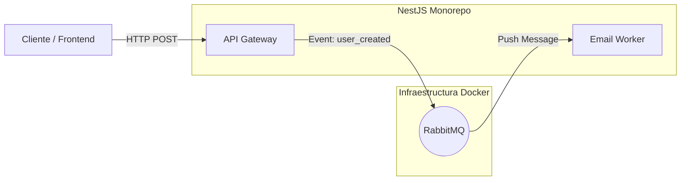
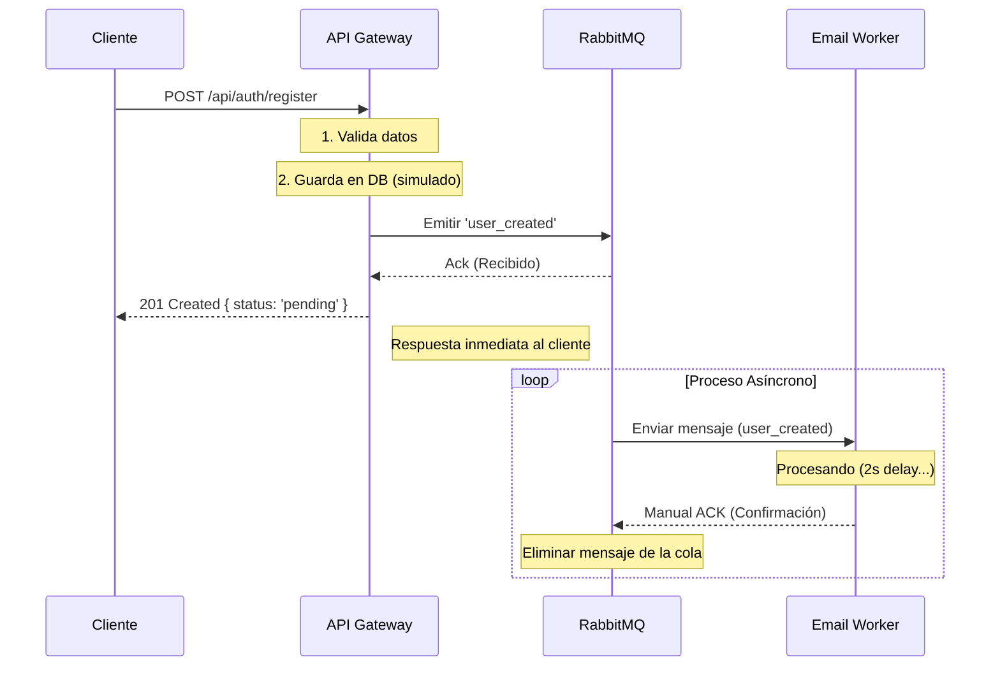

# 🚀 Micro-Events Architecture: NestJS + RabbitMQ

Este proyecto implementa una arquitectura orientada a eventos (Event-Driven Architecture) utilizando **NestJS** y **RabbitMQ**. Demuestra cómo desacoplar servicios mediante mensajería asíncrona, garantizando escalabilidad y resiliencia.

## 📋 Tabla de Contenidos

- [Arquitectura del Sistema](#-arquitectura-del-sistema)
- [Servicios](#-servicios)
- [Flujo de Comunicación](#-flujo-de-comunicación)
- [Conceptos Clave](#-conceptos-clave)
- [Requisitos Previos](#-requisitos-previos)
- [Instalación y Configuración](#-instalación-y-configuración)
- [Ejecución](#-ejecución)
- [Pruebas](#-pruebas)

---

## 🏗 Arquitectura del Sistema

El sistema está compuesto por dos aplicaciones principales dentro de un monorepo Nx, comunicándose a través de un broker de mensajería.



### Componentes

1.  **API Gateway (`apps/api-gateway`)**:

    - Aplicación HTTP estándar (REST).
    - Actúa como **Productor**.
    - Recibe peticiones del cliente y emite eventos a RabbitMQ.
    - Responde inmediatamente al cliente (Non-blocking).

2.  **Email Worker (`apps/email-worker`)**:

    - Microservicio puro (NestJS Microservice).
    - Actúa como **Consumidor**.
    - Escucha la cola de RabbitMQ y procesa tareas en segundo plano (ej. enviar emails).
    - Implementa confirmación manual (ACK) para garantizar la entrega.

3.  **RabbitMQ**:
    - Message Broker que gestiona la cola `notifications_queue`.
    - Garantiza que los mensajes no se pierdan si el worker está caído (Persistencia).

---

## 🔄 Flujo de Comunicación

El siguiente diagrama de secuencia ilustra el patrón **Fire & Forget** implementado:



---

## 🧩 Conceptos Clave

### 1. Aplicación Híbrida / Cliente de Microservicios

En NestJS, no es necesario que una aplicación sea _exclusivamente_ HTTP o _exclusivamente_ Microservicio.

- El **API Gateway** es un híbrido: Sirve tráfico HTTP pero tiene inyectado un `ClientProxy` (módulo `ClientsModule`) para hablar con el mundo de los microservicios.
- Esto permite mantener una API pública rápida mientras se delegan tareas pesadas al backend asíncrono.

### 2. RabbitMQ & Resiliencia

- **Colas Durables (`durable: true`)**: Si RabbitMQ se reinicia, la cola y los mensajes persisten.
- **Confirmación Manual (`noAck: false`)**: El worker debe confirmar explícitamente que procesó el mensaje (`channel.ack(originalMsg)`). Si el worker falla antes de confirmar, RabbitMQ re-encola el mensaje para otro worker.
- **Prefetch Count (`1`)**: El worker solo toma 1 mensaje a la vez, evitando sobrecarga.

---

## 🛠 Requisitos Previos

- **Node.js** (v18 o superior)
- **Docker** y **Docker Compose** (para correr RabbitMQ)
- **pnpm** (recomendado) o npm

---

## 🚀 Instalación y Configuración

1.  **Clonar el repositorio**

    ```bash
    git clone <url-del-repo>
    cd micro-events
    ```

2.  **Instalar dependencias**

    ```bash
    pnpm install
    ```

3.  **Configurar Variables de Entorno**
    Copia el archivo de ejemplo:

    ```bash
    cp .env.example .env
    ```

    _El archivo `.env` ya viene configurado para funcionar con el Docker local._

4.  **Levantar Infraestructura (RabbitMQ)**
    ```bash
    docker-compose up -d
    ```
    - Dashboard de RabbitMQ: [http://localhost:15672](http://localhost:15672) (User: `user`, Pass: `password`)

---

## ▶️ Ejecución

Para correr ambos servicios (Gateway y Worker) en paralelo:

```bash
pnpm dev
# O usando npm
npm run dev
```

Esto ejecutará:

- **API Gateway**: [http://localhost:3000/api](http://localhost:3000/api)
- **Email Worker**: Escuchando eventos de RabbitMQ.

---

## 🧪 Pruebas

Puedes probar el flujo completo haciendo una petición HTTP al Gateway.

**Usando cURL:**

```bash
curl -X POST http://localhost:3000/api/auth/register \
  -H "Content-Type: application/json" \
  -d '{"email": "test@example.com", "name": "Usuario Test"}'
```

**Lo que deberías ver:**

1.  **Respuesta HTTP (Inmediata):**

    ```json
    {
      "message": "Usuario registrado exitosamente",
      "status": "pending_verification"
    }
    ```

2.  **Logs en la Terminal:**
    ```text
    [API] Usuario registrado: test@example.com
    [Worker] Recibido evento para: test@example.com
    ... (2 segundos después) ...
    [Worker] Proceso completado para Usuario Test
    ```
